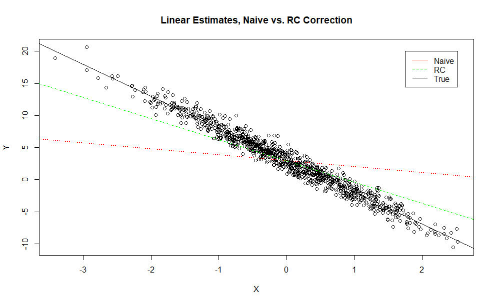

# rCalibration
`rCalibration` provides a light-weight way to compute the regression calibration estimates for covariates which are prone to measurement error, in R. The implementation is as per from Carroll and Stefanski (1990), and can accomodate a single error-prone covariate, with arbitrary numbers of replicate measures, in addition to an arbitrary number of error-free covariates. The implementation can likely be improved for efficiency, and I have not tested the robustness of the methods across widely variable scenarios, as my research mostly entails working with a single error-prone covariate. 

## Basic Usage
The `rCalibration.R` file provides the single `RC` function. It takes two arguments, `W` a matrix of error-prone covariates aranged such that columns represent replicate observations and rows are each individual observation, and `Z` an optional matrix of error-free covariates arranged such that columns represent the different covariates and the rows represent the observations. In `W`, any observation which does not have a corresponding replicate measure should take a value of `NA`. **It is assumed that the first column will contain no `NA`s.**

In response, `X.imp` will be returned, an N-by-1 vector containing the imputed values for `W`.

```{r}
set.seed(3141592) # Seed for reproducibility

# Include the file, changing the directory as needed
source('../rCalibration.R')

# Generate sample Data; 
# True values will be distributed N(0,1); error process N(0,4)
# We will assume that the outcome Y is linear in X: Y=3-5X
X <- rnorm(1000)
Y <- 3 - 5*X + rnorm(1000)

# Error Prone Observations
W1 <- X + rnorm(1000, sd=2)
W2 <- X + rnorm(1000, sd=2)

# Remove 90% of randomly sampled W2 observations
W2[sample(c(1:1000), 900)] <- NA

# Compute the regression calibration estimates
W.r <- RC(cbind(W1, W2))

# Fit the models and plot
mod.fit.naive <- lm(Y~W1)
mod.fit.rc <- lm(Y~W.r)
mod.fit.true <- lm(Y~X)

plot(X,Y, main="Linear Estimates, Naive vs. RC Correction")
abline(mod.fit.naive, lty=3, col='red')
abline(mod.fit.rc, lty=2, col='green')
abline(mod.fit.true, lty=1)
legend(1.75, 20, c("Naive", "RC", "True"), 
       lty=c(3,2,1), col=c("red", "green", "black"))

```



## Bugs, Issues, Etc.
If you notice any bugs, encounter any issues, or have further questions feel free to reach out. If at any point my method is updated or made to be more efficient, I will update this README as well. At this point, I have no plans to expand the functionality. 

## References 
Carroll, R. J. & Stefanski, L. A. [Leonard A.]. (1990, September). Approximate quasi-likelihood estimation
in models with surrogate predictors. Journal of the American Statistical Association,
85 (411), 652–663. doi:10.1080/01621459.1990.10474925
